# btrack Architecture Documentation

## Overview

btrack (Bandwidth Tracker) is a desktop application for tracking project bandwidth allocation across weeks. It follows a hybrid architecture pattern using **Wails v2**, which combines a Go backend with a React/TypeScript frontend, communicating through auto-generated bindings.

## High-Level Architecture

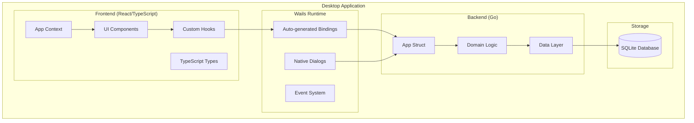

## Technology Stack

| Layer | Technology | Purpose |
|-------|------------|---------|
| Frontend | React 18, TypeScript, Vite | UI rendering and state management |
| Styling | Tailwind CSS | Utility-first CSS framework |
| Charts | Recharts | Data visualization |
| Desktop Framework | Wails v2 | Desktop app packaging and Go-JS bridge |
| Backend | Go 1.24+ | Business logic and data operations |
| Database | SQLite (modernc.org/sqlite) | Local data persistence |

## Backend Architecture

### Application Lifecycle

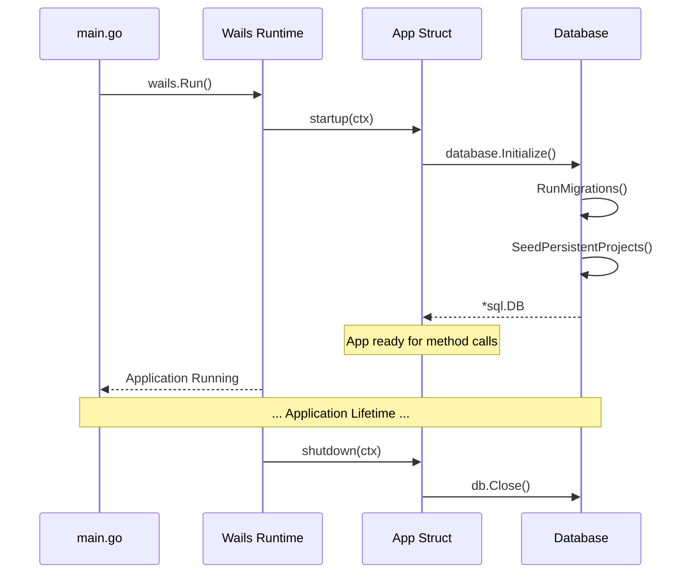

### Backend Package Structure

```mermaid
graph TB
    subgraph "Root Package (main)"
        main[main.go<br/>Entry point, Wails config]
        app[app.go<br/>App struct, lifecycle]
        
        subgraph "Domain Files"
            project[project.go<br/>Project CRUD]
            calculator[calculator.go<br/>Frontloading algorithm]
            weekly[weekly_entry.go<br/>Weekly entries]
            dashboard[dashboard.go<br/>Aggregations]
            meeting[meeting.go<br/>Meeting CRUD]
            note[note.go<br/>Note CRUD]
            goal[goal.go<br/>Goal CRUD]
            task[task.go<br/>Task CRUD]
            template[template.go<br/>Templates]
            backup[backup.go<br/>Backup/Restore]
            export[export.go<br/>CSV Export]
            reports[reports.go<br/>Analytics]
        end
    end
    
    subgraph "internal/database"
        database[database.go<br/>Connection setup]
        migrations[migrations.go<br/>Schema definitions]
        queries[queries.go<br/>SQL constants]
        scanner[scanner.go<br/>Helper utilities]
    end
    
    subgraph "internal/models"
        projectModel[project.go<br/>Project types]
        weeklyModel[weekly_entry.go<br/>Entry types]
        meetingModel[meeting.go<br/>Meeting types]
        noteModel[note.go<br/>Note types]
        goalModel[goal.go<br/>Goal types]
        taskModel[task.go<br/>Task types]
        errors[errors.go<br/>Error types]
    end
    
    app --> database
    project --> queries
    project --> projectModel
    meeting --> meetingModel
    meeting --> scanner
```

### App Struct & Method Binding

The `App` struct is the central point for all backend operations. All **exported** (capitalized) methods are automatically exposed to the frontend via Wails bindings.

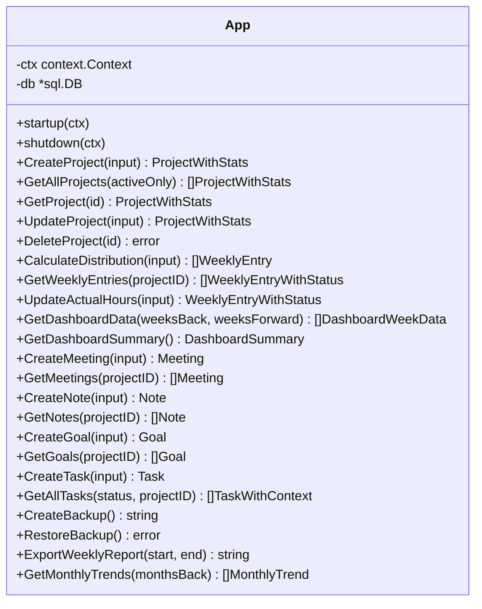

## Data Model

### Entity Relationship Diagram

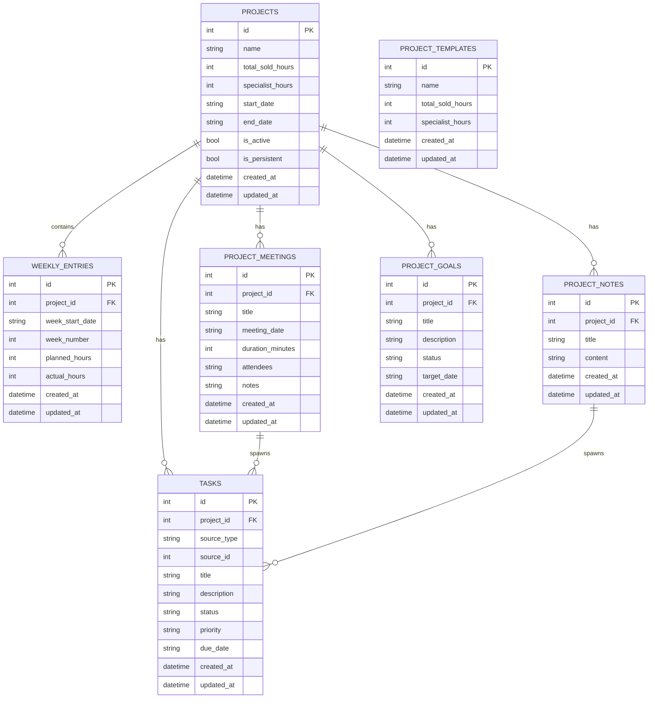

### Key Data Relationships

1. **Projects → Weekly Entries**: One-to-many with cascade delete
2. **Projects → Meetings/Notes/Goals**: One-to-many with cascade delete
3. **Tasks → Sources**: Polymorphic relationship via `source_type` ('standalone', 'meeting', 'note')
4. **Templates**: Standalone, no foreign keys

## Core Algorithms

### Frontloaded Hour Distribution

The `CalculateDistribution` function implements a frontloading algorithm to distribute project hours across weeks:

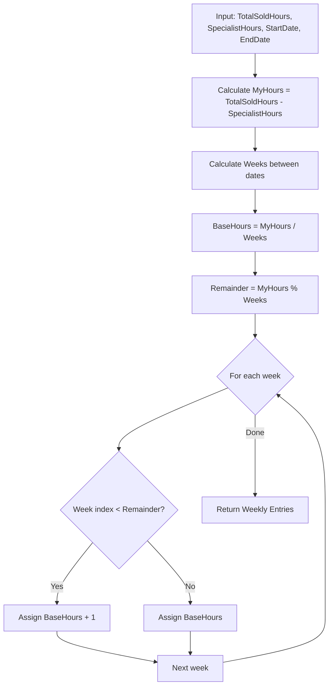

**Example**: 10 MyHours / 3 Weeks → Week 1: 4 hours, Week 2: 3 hours, Week 3: 3 hours

### Project Health Calculation

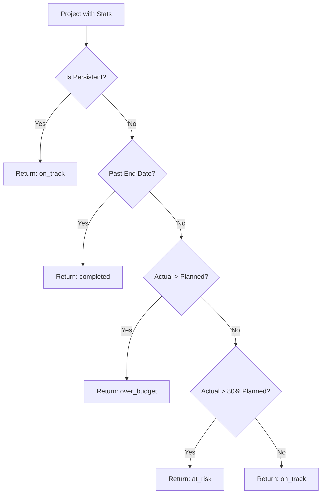

## Frontend Architecture

### Component Hierarchy

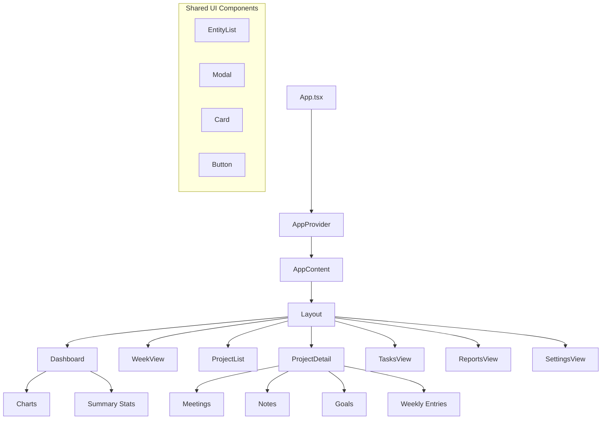

### State Management Pattern

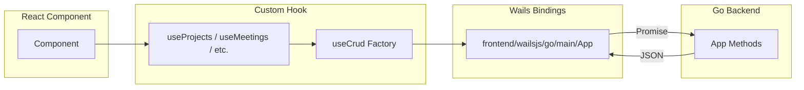

### Custom Hooks Architecture

The `useCrud` factory hook provides standardized async state management:

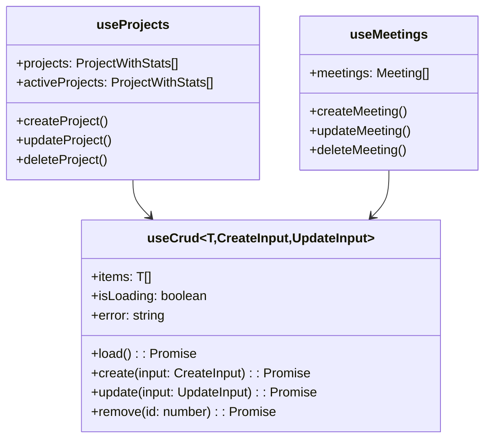

## Data Flow

### Create Project Flow

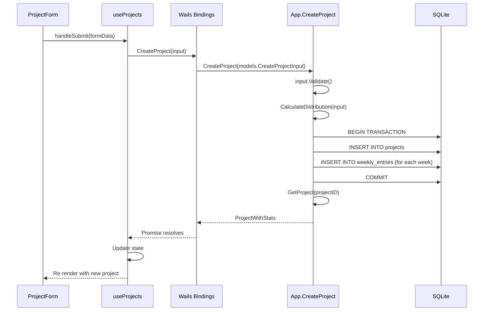

### Weekly View Data Flow

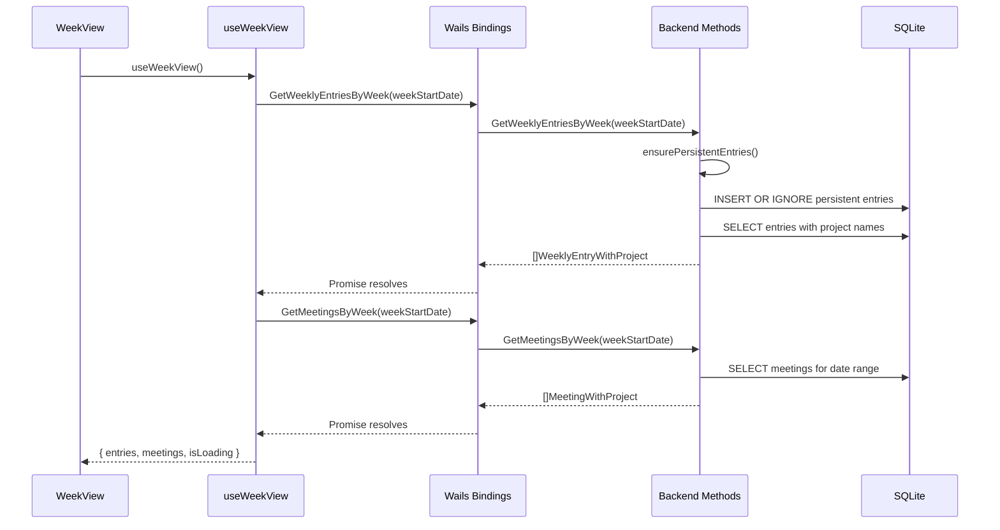

## File Organization

```
btrack/
├── main.go                    # Wails entry point
├── app.go                     # App struct, lifecycle
├── project.go                 # Project CRUD operations
├── calculator.go              # Hour distribution algorithm
├── weekly_entry.go            # Weekly entry operations
├── dashboard.go               # Dashboard aggregations
├── meeting.go                 # Meeting operations
├── note.go                    # Note operations
├── goal.go                    # Goal operations
├── task.go                    # Task operations
├── template.go                # Template operations
├── backup.go                  # Backup/restore
├── export.go                  # CSV export
├── reports.go                 # Analytics/reports
│
├── internal/
│   ├── database/
│   │   ├── database.go        # Connection management
│   │   ├── migrations.go      # Schema definitions
│   │   ├── queries.go         # SQL query constants
│   │   └── scanner.go         # Helper utilities
│   │
│   └── models/
│       ├── project.go         # Project domain models
│       ├── weekly_entry.go    # Entry models
│       ├── meeting.go         # Meeting models
│       ├── note.go            # Note models
│       ├── goal.go            # Goal models
│       ├── task.go            # Task models
│       ├── search.go          # Search result models
│       └── errors.go          # Custom error types
│
├── frontend/
│   ├── src/
│   │   ├── App.tsx            # Root component
│   │   ├── main.tsx           # React entry point
│   │   ├── components/
│   │   │   ├── dashboard/     # Dashboard views
│   │   │   ├── projects/      # Project views
│   │   │   ├── week/          # Week view
│   │   │   ├── weekly/        # Weekly entry components
│   │   │   ├── meetings/      # Meeting components
│   │   │   ├── notes/         # Note components
│   │   │   ├── goals/         # Goal components
│   │   │   ├── tasks/         # Task components
│   │   │   ├── reports/       # Report views
│   │   │   ├── settings/      # Settings views
│   │   │   ├── layout/        # Layout components
│   │   │   └── ui/            # Shared UI components
│   │   ├── hooks/             # Custom React hooks
│   │   ├── context/           # React context providers
│   │   ├── types/             # TypeScript definitions
│   │   └── utils/             # Utility functions
│   │
│   └── wailsjs/               # Auto-generated (DO NOT EDIT)
│       └── go/main/App.ts     # Go method bindings
│
├── build/                     # Build configuration
├── wails.json                 # Wails project config
├── go.mod                     # Go dependencies
└── frontend/package.json      # Node dependencies
```

## Key Design Patterns

### 1. Repository Pattern (implicit)
SQL queries are centralized in `internal/database/queries.go`, providing a single source for all database operations.

### 2. Domain Model Pattern
Business entities are defined in `internal/models/` with validation methods and computed properties.

### 3. Scanner Functions
Entity models include `Scan` functions that encapsulate row scanning logic:
```go
// ScanMeeting scans a database row into a Meeting struct
meeting, err := models.ScanMeeting(rows.Scan)
```

### 4. Slice Helpers
Prevent nil JSON responses using `database.EnsureSlice()`:
```go
return database.EnsureSlice(meetings), nil
```

### 5. Factory Hook Pattern (Frontend)
The `useCrud` hook provides reusable CRUD state management that domain-specific hooks build upon.

## Security Considerations

1. **Local-only storage**: All data is stored locally in SQLite
2. **No network exposure**: Desktop app with no server component
3. **Native dialogs**: Backup/restore uses OS-native file dialogs
4. **Cascading deletes**: Foreign key constraints with CASCADE ensure referential integrity

## Performance Considerations

1. **Indexed queries**: Key columns are indexed (project_id, week_start_date, status)
2. **Lazy loading**: Weekly entries loaded per-project, not all at once
3. **Pagination**: Search results limited to 50 items
4. **Embedded assets**: Frontend built and embedded into binary via `//go:embed`

## Extension Points

1. **New entities**: Add model, migration, queries, domain file, and frontend hook
2. **Reports**: Add query in `queries.go`, method in `reports.go`
3. **Export formats**: Add methods in `export.go` following existing CSV pattern
4. **Frontend views**: Add component folder, hook, and route in `App.tsx`
